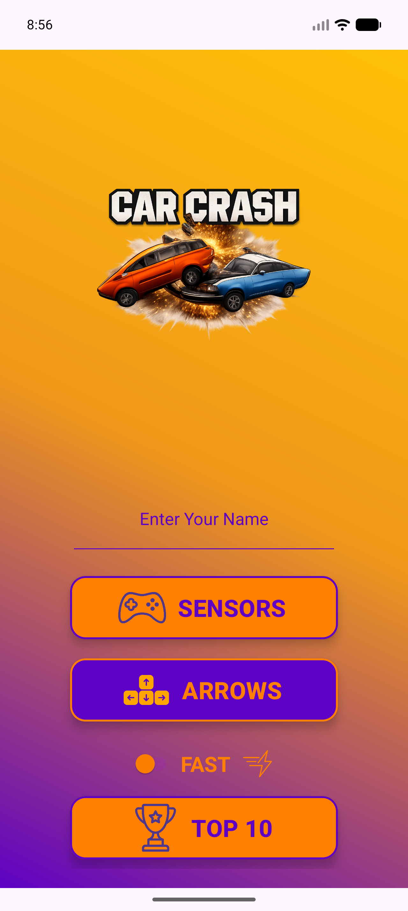
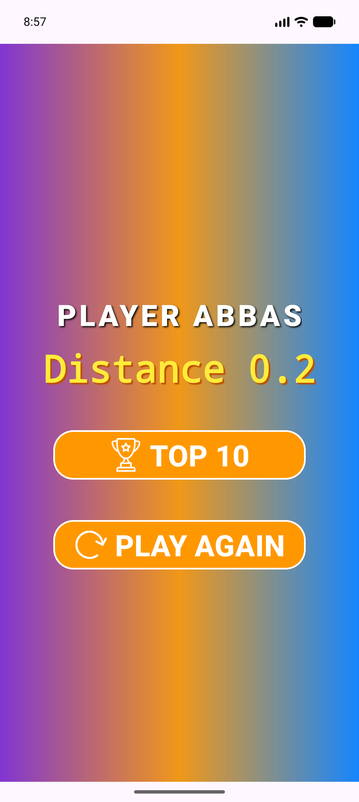
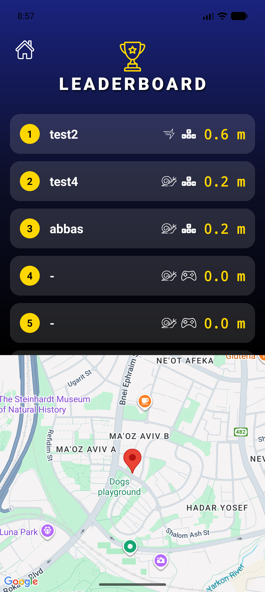

# Car Crash - Android Game

Home Assignment Exercise for Android Application Development course.

## Overview

Car Crash is an exhilarating endless runner game designed for Android devices, developed using **Kotlin**. Test your reflexes by dodging obstacles, collecting coins, and competing for the highest score on the global leaderboard.

## Application Flow

### 1. Getting Started
- **Menu Screen:** Enter your name and customize your game experience.
- **Game Modes:** Choose between **Buttons** (Arrows) or **Sensors** (Tilt) for control.
- **Difficulty:** Toggle "Fast Mode" on or off to set the initial speed.

### 2. Gameplay
- **The Objective:** Navigate a 5-lane highway. Avoid the rocks 🪨 and collect coins 💰.
- **Dynamic Difficulty:** The game speed increases as you survive longer.
- **HUD:** Real-time tracking of your distance (score) and remaining lives (Hearts).

### 3. Game Over & Results
- **Summary:** Instant feedback on your final distance.
- **New Record:** If you crack the Top 10, your score is saved locally.

### 4. Leaderboard & Map Integration
- **Top 10:** View the best scores achieved on the device.
- **Location Tracking:** Every high score saves the GPS location where it was achieved.
- **Map View:** Clicking a score in the list zooms into that specific location on the Google Map fragment.

## Features

- **Dual Control Systems:** Play using traditional on-screen buttons or utilize the phone's accelerometer (Tilt).
- **Location Awareness:** Uses the Fused Location Provider to tag high scores with real-world coordinates.
- **Persistent Data:** High scores are saved using SharedPreferences and Gson.
- **Immersive Audio:** Background music and sound effects (Crash, Collect) with proper Lifecycle management.
- **Haptic Feedback:** Vibration effects upon collision.

## Technology Stack

- **Language:** Kotlin
- **Architecture:** MVVM (Model-View-ViewModel pattern)
- **UI:** XML Layouts, ViewBinding
- **Google Services:** Google Maps SDK, Location Services
- **Data Storage:** SharedPreferences (JSON via Gson)

## How to Play

1. **Setup:** Enter your name in the main menu.
2. **Select Mode:** Choose "Sensors" to steer by tilting your phone, or "Arrows" to tap.
3. **Survive:**
   - **Rocks:** Hit 3 rocks and it's Game Over.
   - **Coins:** Collect them for bonus points.
4. **Win:** Try to beat the longest distance!

## Contributing

This project is part of an academic course. Pull requests are welcome for bug fixes or optimizations.